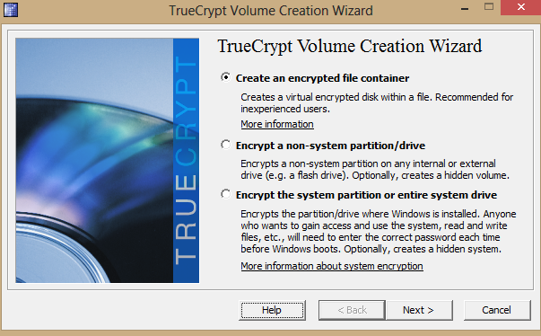
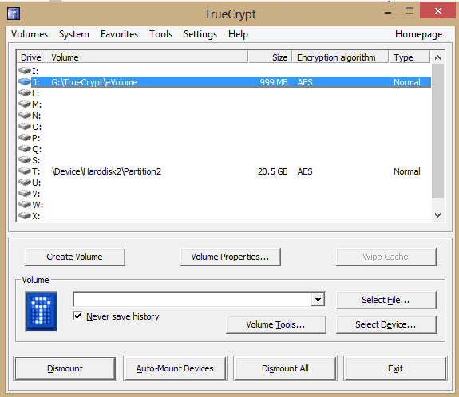

You don’t need to be a member of some elite agency to justify keeping you data safe and secure. Loosing a USB Thumb Drive with your accounts on it, a report you did for work or photos that you just don’t want seen can open you up to identify theft or worse – Facebook abuse. Thankfully there are freely available apps to help you out here, a good one that I use is TrueCrypt.

TrueCrypt allows you to create an encrypted folder on your PC, Mac or USB Thumb Drive. You can either install the

application on your PC or carry it around your USB stick.

###Here are some of the main features of TrueCrypt:

Creates a virtual encrypted disk within a file and mounts it as a real disk.
Encrypts an entire partition or storage device such as USB flash drive or hard drive.
Encrypts a partition or drive where Windows is installed
Provides Hidden Volumes, so that the encrypted folders do not show up when users browse the device
You’ll find the application available on the TrueCrypt website on http://www.truecrypt.org.

###Setting up a USB Stick

Download TrueCrypt from the site above
Run the installer
Choose Extract when asked for the installation mode. This will just copy the files to a location and not install them on the computer.
Choose a location on your USB Stick to put the files (I suggest a folder called TrueCrypt… surprise surprise)
When the files are extracted, open the location you selected and make sure you can see the files.
Setting up TrueCrypt on your PC

Download TrueCrypt from the site above
Run the installer
Choose Install when asked for the installation mode. This will just copy the files to the computer so that it can start up automatically when the computer starts.
Keep the defaults and click Install.
Create an encrypted folder

TrueCrypt calls them volumes, so that’s what we’ll refer to them as from here on.

Run TrueCrypt.exe from the USB Stick and follow the Wizard.
Click Create a Volume
Choose Create an Encrypted file container
Choose Standard TrueCrypt volume
Select a folder on the USB Drive to the volume in.
On the Encryption Options use the defaults
Choose the size you want. Think about how big the drive is and how much data you bring around with you. I choose 1000MB.
Now choose a password. Don’t forget this. There is no “I forgot my password option”
Press Next and Format the volume.
You’re all done.
Add data to you volume

The idea here is to add the volume as a new drive. So just like the C: or D: we’ll create a P drive (P for Private, but you can put it anywhere)

Run TrueCrypt.exe and you’ll see the screen above
If the P drive is not in use, select it. Otherwise select any free slot.
Click Select File, and choose the volume you created above.
Finally click Mount.
Now, open Windows Explorer and you’ll see the P: there ready and waiting to keep you’re data safe.
It’s worth noting that if you extract TrueCrypt to a usb key then you will have to do the steps above whenever you connect your USB to a PC.