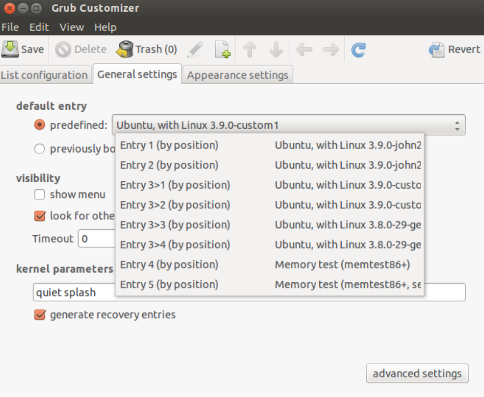

Ever curious about how you would go about compiling the linux kernel?

This is a quick guide on getting the latest linux code, building new debian packages and installing them.

***Warning!! / Disclaimer!! / Common Sense Alert!!***

You guessed it! This can hose your OS, so best do this on a virtual machine!


##Installing the dependencies

First we must install the version control management software GIT, this is required so that we can pull down the repository where the source code for the Linux Kernel is maintained.
This is not an entirely necessary step as the source could be downloaded as a Tarball and extracted to the disk, but GIT is the preferred way to alter Linux and provides some excellent tools to manage
changes - as we will see later when we create a diff of all our changes to the source code.

Execute the following command to install GIT.

``` bash
sudo apt-get install -y git-core
```

We then require the build-essential package. This is required for compiling the source code into binaries and building Debian packages.
It includes the g++ complier, c libraries, make and the packager builder (Mepis, 2013).

``` bash
sudo apt-get install -y build-essential
```

The next dependency **kernel-package** provides the capability to create custom Debian kernel package images and their associated
headers into a header image.

``` bash
sudo apt-get install -y kernel-package
```
<linebreak>

Fakeroot is a convenience for our build that provides the ability to perform a kernel build without being root (Ltd, 2013). This provides wrappers around many functions such as chown, getuidetc. which creates a fake root environment.

``` bash
sudo apt-get install -y fakeroot
```

When our kernel is compiled and installed, we may need to tell the system which kernel to use. The application to do this is called grub-customizer and it will allow us to set the start-up kernel accordingly.

``` bash
sudo add-apt-repository ppa:danielrichter2007/grub-customizer

sudo apt-get update

sudo apt-get install -y grub-customizer
```

Finally we need this last dependency. This retrieves the source code for the currently installed binary package which is necessary for the build (Ubuntu WiKi, 2013).

``` bash
sudo apt-get build-dep --no- install-recommends linux-image- $(uname -r)
```

##Retrieving the current version

We will be using the kernel source located on git.kernel.org, in particular the repository maintained by Linux Torvalds, the creator of Linux.
First we will clone the repository. This will retrieve the source code for all versions of Linux which will allow us to choose a stable release from the pipeline.

``` bash
git clone git://git.kernel.org/pub/scm/linux/ kernel/git/torvalds/linux.git
```

In order to get to the version of the source code we would like to work on, we must checkout the appropriate branch.
Using the ```git tag``` command we can see all available branches (2.6.11 to 3.9-RC8). We will choose v3.9 – the last stable version that was not a release candidate.

``` bash
cd linux
git checkout v3.9
```

The following step is not necessary but is considered best practice. We will create a branch of the repository in which we will do our work. Giving it the name “v3.9_custom”

``` bash
git checkout -b v3.9_custom
```

##Preparing the build

With the source code downloaded and the dependencies installed, we can begin the build process.
To ensure the new build is configured with our system defaults we will copy over the current systemboot configuration file into our kernels build folder.

``` bash
cp /boot/config-`uname -r` .config
```

Since we are copying over a configuration file for an old build, it stands to reason that there might be new options not set in
the configuration that are required by the new kernel. The following command will set the defaults for any options not found in the current configuration file.

``` bash
yes '' | make oldconfig
```

The last step in the preparation is to clean out all previously built objects. This is useful if you are running the build process multiple times.

``` bash
make clean
```

##Building the kernel
Now we compile the kernel. The command below specifies that we run the make instruction inside fakeroot.
This allows us to build the kernel without being root as specified above in the dependencies section.
We also specify that we should use all the processors available on the system and the output package should be versioned with the text “opsyscall”.

``` bash
fakerootmake -j `getconf _NPROCESSORS_ONLN` deb-pkg LOCALVERSION=-opsyscall
```

This command can take quite some time to run depending on the hardware or virtualised environment. We tried various configurations and here are the comparisons
of the build times.

| # Cores | Build Time (minutes) |
|:-----:|-------------:|
| 1     | 89m 51.697s |
| 2     | 53m 08.310s |
| 4     | 35m 20.431s |
| 8     | 26m 59.720s |

***Kernel build time comparison for varying numbers of cores on an Intel® Xeon(R) CPU X5650 @ 2.67GHz × 8 running Ubuntu 12.04 LTS on VMware vSphere® Hypervisor.***

Once the build process completes we will be left with four .deb packages in the parent directory to the source code, named after the version of the kernel and
the customised local version specified above. There will be a headers image for use if we want to compile modules later on. The other packages are the kernel
image, which contains the actual kernel, the firmware image containing other licenced firmware that is not included in the kernel and finally
and libc image containing headers for building the kernel – which will be necessary for subsequent builds.

##Install the kernel

With the kernel compiled we now want to install it. This is easily done using the Debian Package utility dpkg. The commands below install the packages and reboot the machine.

``` bash
Sudo dpkg –i linux-*
sudo reboot
```

Once rebooted, you can see the version of the kernel installed using

``` bash
uname–r
```

In our case it will be “3.9.0_opsyscall”

##Booting with the new kernel

With many kernel builds installed we will need to specify which one we want to boot with. To do this we will use the grub-customizer tool that we installed earlier.
This is a graphical interface that will allow us to choose the kernel that the grub boot-loader will choose during start-up.


***Screen grab from grub customizer.***

It also allows for the boot menu to be displayed for a set time period to allow for a previous kernel version to be chosen – should your latest version have errors and not boot.

## That's it!

Next step is to create your own system call and add it to the kernel. Happy Hacking!
