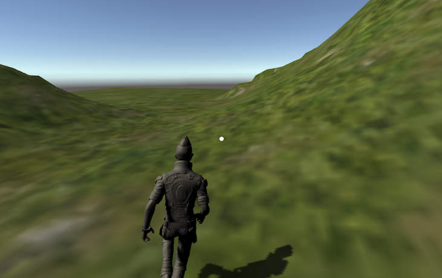

I haven't written a piece in a while but while I was playing around with a Unity3d and a Google Cardboard VR Headset, I found quite a few people had difficulty with getting a workable ***Third Person Locomotion controlled by the headset***. So, here we'll build up to that with a few simple working controls and then put them together to control a character model at the end.

With Google Virtual Reality here's 2 things we're going to achieve

- Move around a scene using a Google Cardboard VR kit in the First Person
- Create a Character and control its motion in a Chase view with the Cardboard Headset



### Lets get things set up

- Install Unity (I'm using 2018.1.5f1 Personal)
- Install [Google VR SDK](https://developers.google.com/vr/develop/unity/get-started-ios) (I'm using GoogleVRForUnity_1.130.1)
- Create Demo Project to verify it all works by following the instructions above.
- Additional setting
  - Under Resolution and Presentation, uncheck all except ***Landscape Left***, this fixes a bug in the GVR SDK

### Create Terrain and Skybox

I find it's always nice to have something to look at, so lets create a landscape and an object that has some behaviour. Also - it will give us a reference point when we move.

- Create Terrain
  - Goto ```Assets >Import Package >Environment```
  - Goto Inspector > Click paint brush > Edit Textures

- Create Skybox
  - Goto ```Window > Lighting > Settings```
  - Set the Skybox Material (i use Cope)

- Create the objetc for some interaction
  - Create ```GameObject > 3d Object > Cube```
  - Add component EventTrigger, this allows the raycaster to detect it.
  - Finally add a script that will spin the cube and add the following

  ```c#
  public float spinValue = 90;
  // Spin the Cube
	void Update () {
        transform.Rotate(Vector3.up * spinValue * Time.deltaTime);
	}
  ```

### Add the VR components

- Add the VR Assets as described in the link above
  - GvrEditorEmulator
  - GvrControllerMain
  - GvrEventSystem
  - GvrRecticlePointer (add to MainCamera)
  - GvrPointerPhysicsRayCaster (add to MainCamera)

- Create a Player
  - Create ```Menu>GameObject > Empty Object``` and rename to Player
  - On the Player Object add a CharacterComponent
  - Drag main camera to Player
  - Select Camera and right click on transform and click reset
  - Set Player Position to 1.8
    - we'll use each unit as a meter

## Lets go for a stroll

### First Person View

Add the 4 scripts below to the

- VRLookWalk.cs

  ```c#
  using UnityEngine;
  using System.Collections;

  [RequireComponent(typeof(CharacterController))]
  public class VRLookWalk: MonoBehaviour
  {
      public float speed = 3.0F;

      private CharacterController characterController;
      private Transform cameraTransform;

      void Start()
      {
          characterController = GetComponent<CharacterController>();
          cameraTransform = Camera.main.transform;
      }

      void Update()
      {
          Vector3 forward = cameraTransform.TransformDirection(Vector3.forward);
          characterController.SimpleMove(forward * speed);
      }
  }
```

- VRAutoWalkLookDown.cs

  ```c#
  [RequireComponent(typeof(CharacterController))]
  public class VRAutoWalkLookDown : MonoBehaviour {

      public Transform cameraTransform;
      public float toggleAngle = 10.0F;
      public float speed = 3.0F;
      public bool moveForward;

      private CharacterController characterController;


    // Use this for initialization
    void Start () {
          characterController = GetComponent<CharacterController>();
          cameraTransform = Camera.main.transform;
    }

    // Update is called once per frame
    void Update () {

          if (cameraTransform.eulerAngles.x >= toggleAngle
            && cameraTransform.eulerAngles.x <= 90.0f)
              moveForward = true;
          else
              moveForward = false;

          if(moveForward){
              Vector3 forward = cameraTransform.TransformDirection(Vector3.forward);
              characterController.SimpleMove(forward * speed * toggleAngle / 5);
          }
    }
  }
  ```

- VRLookWalkKeyboard.cs

  ```c#
  [RequireComponent(typeof(CharacterController))]
  public class VRLookWalkKeyboard: MonoBehaviour
  {
      public float speed = 3.0F;
      public float rotateSpeed = 3.0F;

      private CharacterController characterController;
      private Transform cameraTransform;

      void Start()
      {
          characterController = GetComponent<CharacterController>();
          cameraTransform = Camera.main.transform;
      }

      void Update()
      {
          // read inputs
          var x = Input.GetAxis("Horizontal");
          var z = Input.GetAxis("Vertical");
          // Move Left/Right
          characterController.transform.Rotate(0, x, 0);

          // Move forward/backward
          float curSpeed = speed * z;
          Vector3 forward = cameraTransform.TransformDirection(Vector3.forward);
          characterController.SimpleMove(forward * curSpeed);

      }
  }
  ```

- VRLookWalkMagneticClick.cs

  ```c#
  public class VRLookWalkMagneticClick : MonoBehaviour {

      public Transform cameraTransform;
      public float toggleAngle = 10.0F;
      public float speed = 3.0F;
      public bool moveForward;

      private CharacterController characterController;

    // Use this for initialization
    void Start () {
          characterController = GetComponent<CharacterController>();
          cameraTransform = Camera.main.transform;
    }

    // Update is called once per frame
    void Update () {
          if (Input.GetButtonDown("Fire1"))
          {
              moveForward = !moveForward;
          }

          if (moveForward)
          {
              // Find the forward direction
              Vector3 forward = cameraTransform.TransformDirection(Vector3.forward);
              characterController.SimpleMove(forward * speed * toggleAngle / 5);
          }
    }
  }
  ```

Only check one of these at a time to test them all out.

### Third Person View

This is the one most people will be interested in - ** controlling a Character with head movement **

- Create a new Scene as above but stop at the **Create Player** stage
- Goto ```Assets >Import Package >Characters```
- Drag the new asset ```Standard Assets/Characters/ThirdPersonCharacter/Prefabs/ThirdPersonController``` to the scene (His name is Ethan apparently)
- Click the ThirdPersonController and uncheck the ```Third Person User Control (Script)```
  - We don't want to use this locomotion, we'll write out own and bind it to the ThirdPersonController
- Create an Empty Object and call it CameraCradle - drag it to the ThirdPersonController
- Drag the Main Camera to the CameraCradle
- In the Scene View, align the view to Ethan, then Menu>Game Object>Align With Viwe
  - This will match the Camera to the position you have the scene in, and will stick it there as it's a child object
- Add this script to the MainCamera ThirdPersonVRController.cs

    ```c#
    public class ThirdPersonVRController : MonoBehaviour {
        // A reference to the ThirdPersonCharacter on the object
        public ThirdPersonCharacter m_Character;
        // A reference to the main camera in the scenes transform
        private Transform m_Cam;

        void Start()
        {
            Debug.Log("Started");
            // get the transform of the main camera
            if (Camera.main != null)
            {
                m_Cam = Camera.main.transform;
            }
            else
            {
                Debug.LogWarning(
                    "Warning: no main camera found. Third person character needs a Camera tagged \"MainCamera\", for camera-relative controls.", gameObject);
                // we use self-relative controls in this case, which probably isn't what the user wants, but hey, we warned them!
            }
        }

        void Update()
        {
            Vector3 forward = m_Cam.TransformDirection(Vector3.forward);
            m_Character.Move( forward, false, false);
        }
    }
    ```

- Finally, there is a public property **Character** on the script above. Select the MainCamera in the Hierarchy View, and you will see it in the Inspector window.
  then from the Hierarchy View drag the ThirdPersonController to the Character property in the Inspector Window - binding it to the script.
- Hit Play, and you should be controlling Ethan with slight head motion.
- Play around with the script and you can make the motion smoother.

### References and shoutouts

I'm a n00b to Unity and VR, and it took me about a week to figure this out.
Most of what follows is based on these Tutorials and amalgmating pieces of each

- [Movement In Mobile VR: Autowalk by NurFACEGAMES](https://www.youtube.com/watch?v=JmgOeQ3Gric) - Character Control using CaharacterController
- [Movement In Mobile VR: Look Walk by NurFACEGAMES](https://www.youtube.com/watch?v=kBTn2pGwZUk) - Walking
- [Creating a Google Cardboard VR app in Unity 2017 by Rabidgremlin](https://www.youtube.com/watch?v=EAaoEe9ksyE) - Object interaction
- [Unity 3D - How to make your First Terrain (Beginner Tutorial) By DEYEmaginary](https://www.youtube.com/watch?v=WMBsdhELSwE)

